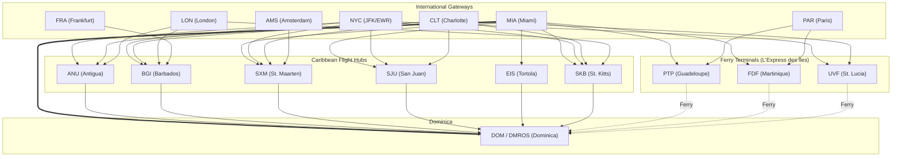

# ✈️⛴️ Prop & Ferry

**Prop & Ferry** is a full-stack Caribbean travel aggregator and proof-of-concept application designed to bridge the gap between major international airline routes and regional airlines (Liat20, Winair, interCaribbean) and island-hopping ferries (like FRS Express).

As an aviation nerd born in Dominica and residing in NYC, I built this application to solve a personal pain point: many Caribbean destinations lack direct international flights, requiring complex, unlinked transfers between planes and ferries. This application automatically maps and stitches these disparate transit networks together, surfacing overnight-aware connections and providing a unified booking interface.

**🌍 [View the Live Demo: prop-ferry.rajivwallace.com](https://prop-ferry.rajivwallace.com)**

## ⚠️ Proof of Concept Disclaimer

This application is a Proof of Concept (POC) built to demonstrate complex system architecture, in-memory graph traversal, and aggregator quota governance. It is actively maintained as an engineering portfolio piece.

While the data powering the frontend is sourced **live** via the Duffel REST API and automated web scrapers, **the booking window is intentionally restricted to a 3-day rolling forecast.** This constraint is a deliberate engineering tradeoff designed to stay well within aggregator free-tier allowances and prevent excess search surcharges while keeping the core routing logic fully functional for demonstration.

---

## 📑 Table of Contents

- [🚀 Tech Stack](#-tech-stack)
- [🧠 Core Architecture & Features](#-core-architecture--features)
- [📉 System Design: Free-Tier Sustainability & Look-to-Book Governance](#-system-design-free-tier-sustainability--look-to-book-governance)
- [🔄 Architecture Shift: The Amadeus Deprecation](#-architecture-shift-the-amadeus-deprecation)
- [⚙️ CI/CD & Monitoring](#️-cicd--monitoring)
- [💻 Local Development](#-local-development)
- [📫 Contact](#-contact)

---

## 🚀 Tech Stack

**Frontend:**

- React 19 & TypeScript
- Tailwind CSS v4 (Custom UI with Dark/Light mode)
- Vite

**Backend:**

- Django & Django REST Framework (DRF)
- PostgreSQL & Redis (Isolated container network)
- BeautifulSoup4 (Ferry Web Scraping)
- Duffel REST API (Flight Data)

**Infrastructure & CI/CD:**

- Self-hosted on a Raspberry Pi 4B (DietPi OS) within a Ubiquiti UniFi segmented network
- Docker & Docker Compose
- GitHub Actions (Automated CI/CD Deployments & ETL Pipelines)
- HashiCorp Vault (Secrets Management)
- Nginx Proxy Manager & Cloudflare (Ingress & Reverse Proxy)
- Prometheus, Grafana, & Discord Webhook Alerts

---

## 🧠 Core Architecture & Features

### 1. In-Memory Graph Traversal (The "Stitcher")

Rather than relying on computationally expensive recursive SQL queries, the backend pulls normalized route data and uses O(1) set lookups to map topologies in memory. The stitcher natively understands overnight delays, dynamically flagging connections that require a hotel stay before an onward ferry transfer.

### 2. Backend API & Aggressive Redis Caching

Prop & Ferry calculates multi-leg travel itineraries by stitching together intersecting flights and marine sailings. Because computing dynamic routing with overnight layover logic is computationally expensive, the Backend API is heavily optimized:

- **Pre-Serialization Caching:** Instead of caching raw Django HTTP responses (which breaks Django REST Framework serialization and CORS), the app intercepts requests at the view level and caches raw Python dictionary payloads in Redis. 
- **Idempotent Search Results:** Complex route calculations are cached dynamically using a combined `{origin}_{destination}_{date}` cache key. This guarantees that duplicate searches from users exploring the same routes result in instantaneous, memory-served responses.
- **Static Reference Caching:** High-volume initialization endpoints (like the complete lists of Locations and Carriers) are cached for extended periods, reducing the initial frontend load time to mere milliseconds and preventing database I/O bloat.

### 3. Dual-Source ETL Pipeline

The database is actively maintained by two distinct, automated scrapers triggered by GitHub Actions cron jobs:

- **The Flight Scraper:** Interfaces with the Duffel REST API to pull active schedules, pricing, and seat availability. Employs adaptive request pacing (0.5s baseline) and bounded exponential backoff ($\le 3$ retries with `Retry-After` header inspection) to eliminate HTTP 429 burst-rate throttling.
- **The Ferry Scraper:** Uses `requests` and `BeautifulSoup` to scrape, parse, and normalize ferry schedules (FRS-Express) into the application's standard `ApiLeg` contract.

---

### 📉 System Design: Free-Tier Sustainability & Look-to-Book Governance

Operating a live flight aggregator out-of-pocket requires strict pipeline governance. In flight aggregation, providers enforce **Look-to-Book (Search-to-Book) ratios** (standard industry baseline of 1,500:1) to prevent non-converting automated traffic from overwhelming airline reservation systems. 

Under Duffel's pricing model, accounts with zero monthly bookings are treated as having 1 order, granting a **baseline allowance of 1,500 free searches per month**. Searches beyond this quota incur an **Excess Search Fee of $0.005 per call**.

Querying a naive, brute-force Cartesian matrix across all Caribbean destinations and international gateways would rapidly blow past this quota. To ensure the application operates at **$0.00 actual cost** while preserving a large safety margin, the ETL pipeline utilizes a **Domain-Driven Waterfall Discovery Strategy**:

- **The Global Constraint Map:** Queries strictly model real-world aviation corridors across 7 Gateways and 9 Regional Hubs:
  - **North America:** `NYC` (transits `JFK`/`EWR`), `MIA` (direct American Airlines to `DOM`, `EIS`, `FDF`, `PTP`, `SJU`, `SXM`, `SKB`), and `CLT` (American Airlines hub feeding `ANU`, `BGI`, `UVF`, `SJU`, `SXM`, `SKB`).
  - **Europe:** `LON` (feeds Commonwealth hubs `ANU`, `BGI`, `SKB`), `PAR` (feeds French ferry ports `PTP`, `FDF`), `AMS` (direct KLM to `SXM`), and `FRA` (direct Condor to `BGI`).
  - **Direct Non-Stops to `DOM`:** Discovers direct non-stop trunks (`MIA <-> DOM`, `NYC <-> DOM`) and active island turboprop/jet feeders (`ANU`, `BGI`, `SXM`, `SJU`, `EIS`, `SKB`).
- **Ferry Hand-Offs:** The pipeline cross-references maritime data from *L'Express des Îles* (`PTP`, `FDF`, `UVF` / Castries $\leftrightarrow$ Roseau `DMROS`), suppressing air queries for routes where sea transport is the dominant default.
- **Phase 1 (Saturday Anchor Discovery):** A weekend sweep tests ~25 core trunk routes to map active operational realities. If an airline suspends or reschedules a route, the system automatically prunes it.
- **Phase 2 (The Targeted Sweep):** The script executes a rolling 3-day sweep *only* on confirmed active routes.



**The Math (Why 3 Days?):**
By maintaining a **3-day rolling window**, the discovery pipeline executes roughly **50 calls per run**:

- `50 calls * 8 runs/month = ~400 calls / month`
- **Quota Consumption:** Uses only **26%** of Duffel's 1,500 free monthly search allowance.
- **Safety Margin:** Leaves ~1,100 free searches as a buffer for local testing, container restarts, and manual workflow dispatches.
- **Total Incurred Cost:** **$0.00** (zero excess search fees).
- **Execution Time:** **$\approx 40$ seconds** on the self-hosted DietPi runner.

**Risk vs. Reward:** This tradeoff restricts a user's ability to plan vacations weeks in advance. However, the architectural reward is immense: it ensures a 100% live, self-healing database that seamlessly feeds the backend Stitcher (graph traversal) algorithm, proving the core routing logic operates flawlessly under enterprise constraints.

### Raspberry Pi Hardware Protection & Database Provisioning

To protect the host SD card from I/O degradation and database bloat:

- The PostgreSQL instance resides on a dedicated, isolated `database` Docker network preventing any external ingress. Database catalogs and user roles are dynamically provisioned via automated initialization scripts to completely segregate Prop & Ferry's data layer from other homelab applications.
- The ferry scraper executes within an `atomic` database transaction, cleanly wiping and replacing the current schedule without locking the UI.
- Both scrapers actively prune historical (past-date) transit records on initialization to keep PostgreSQL queries lightning fast.

---

### 🔄 Architecture Shift: The Amadeus Deprecation

In its original iteration, this project relied on the **Amadeus Self-Service API** and its official Python SDK. However, Amadeus has been formally deprecated from this architecture in favor of the **Duffel REST API**.

This migration was executed for three critical engineering reasons:

1. **Discontinued Developer Support:** The Amadeus Python SDK and Self-Service developer portals suffer from a lack of modern support, frequent undocumented endpoint changes, and an overall degraded developer experience.
2. **SDK Dependency Risk:** Rather than relying on an abandoned or poorly maintained third-party SDK, the new Duffel integration utilizes standard Python `requests`. This removes a fragile dependency from the project and ensures the ETL pipeline communicates directly with the modern REST endpoints.
3. **Distribution Networks:** Amadeus's free tier aggressively sandboxes real-world data and frequently fails to capture major US carriers (like American Airlines). Duffel's Direct Connect (NDC) integration and Hahn Air partnerships natively surface the exact flights required to make Caribbean island-hopping functional.

_Note: The original Amadeus scraper (`fetch_routes.py`) remains in the repository's `backend/core/management/commands/` directory for historical context and rollback capabilities, but is flagged with a deprecation warning and is no longer executed by GitHub Actions._

---

## ⚙️ CI/CD & Monitoring

> [!NOTE]
> **CI/CD Evolution:** This project is deployed using a decentralized **GitHub Actions** edge runner, having migrated from a legacy Jenkins/JVM monolith to optimize compute overhead and security. 
> The legacy Groovy pipelines have been preserved for historical context in the [`archive/jenkins-pipeline`](https://github.com/rajivghandi767/prop-and-ferry/tree/archive/jenkins-pipeline) branch.

Automated GitHub Actions pipelines handle the full lifecycle of the application:
- **Deployment:** Commits to `main` trigger tests, build Docker images, and deploy seamlessly via zero-downtime rolling restarts. Nightly deployments run automatically at `03:00 AM` EST. HashiCorp Vault is dynamically queried to inject runtime secrets, maintaining strict configuration management.
- **Observability Stack:** Prometheus scrapes metrics across the containers, alerting Discord via Alertmanager if memory limits or service drops are detected.

ETL pipelines manage data fetching directly within the production Docker containers via SSH:
- **Flights:** Runs at `03:30 AM` every Sunday & Wednesday.
- **Ferries:** Runs at `03:45 AM` every Sunday & Wednesday.
- **Alerting:** If Duffel returns an unknown airport code or a new airline carrier, the backend triggers a Discord Webhook, alerting the developer to enrich the database topology manually.

---

## 💻 Local Development

This section details how to replicate this environment locally. Everything is fully plug-and-play for local development without the need to manually modify `docker-compose.yml` configurations or environment paths.

> ⚠️ **Architecture Note:** To ensure strict parity with the production environment and eliminate local dependency issues, this project is exclusively containerized. Please ensure you have Docker installed before proceeding.

### Prerequisites

- 🐳 Docker & Docker Compose

### Getting Started

Local `docker-compose.yml` and `Dockerfile` configurations are already set to build directly from the source code folder for local development rather than pulling registry images. The `docker-compose.yml` is hardcoded to use `.env.example`, so absolutely no environment configuration is required.

**Spin up the stack:**
```bash
docker compose up -d --build
```
*Note: The database migrations and seed data scripts are automatically executed during container startup, securely bypassing any API restrictions!*

**Accessing Local Services:**
- Frontend: `http://localhost:5173`
- Backend API: `http://localhost:8000`

---

## 📬 Let's Connect

**Rajiv Wallace**  
*Self-taught Software Engineer based in NYC (originally from Dominica 🇩🇲). Aviation nerd, Formula One fan, Chelsea FC supporter, and passionate about robust Backend Development and bare-metal DevOps.*

[](https://www.linkedin.com/in/rajiv-wallace)
[](mailto:dev@rajivwallace.com)
[](https://rajivwallace.com)
